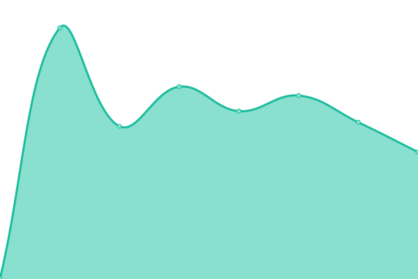

# [📈 Live Status](https://status.visoftware.dev): <!--live status--> **🟩 All systems operational**

This repository contains the open-source uptime monitor and status page for [VI Software](https://visoftware.dev), powered by [Upptime](https://github.com/upptime/upptime).

With [Upptime](https://upptime.js.org), you can get your own unlimited and free uptime monitor and status page, powered entirely by a GitHub repository. We use [Issues](https://github.com/VI-Software/status/issues) as incident reports, [Actions](https://github.com/VI-Software/status/actions) as uptime monitors, and [Pages](https://status.visoftware.dev) for the status page.

<!--start: status pages-->
<!-- This summary is generated by Upptime (https://github.com/upptime/upptime) -->
<!-- Do not edit this manually, your changes will be overwritten -->
<!-- prettier-ignore -->
| URL | Status | History | Response Time | Uptime |
| --- | ------ | ------- | ------------- | ------ |
|  [VI Software Portal](https://visoftware.dev) | 🟩 Up | [vi-software-portal.yml](https://github.com/VI-Software/status/commits/HEAD/history/vi-software-portal.yml) | 

 1413ms
     
 | 

<a href="https://status.visoftware.dev/history/vi-software-portal">98.05%</a>
    

|  [VI Software API](https://api.visoftware.dev) | 🟩 Up | [vi-software-api.yml](https://github.com/VI-Software/status/commits/HEAD/history/vi-software-api.yml) | 

 494ms
     
 | 

<a href="https://status.visoftware.dev/history/vi-software-api">98.14%</a>
    

|  [VI Software Yggdrasil Auth Server](https://authserver.visoftware.dev) | 🟩 Up | [vi-software-yggdrasil-auth-server.yml](https://github.com/VI-Software/status/commits/HEAD/history/vi-software-yggdrasil-auth-server.yml) | 

 461ms
     
 | 

<a href="https://status.visoftware.dev/history/vi-software-yggdrasil-auth-server">98.14%</a>
    

|  [VI Software CDN](https://cdn.visoftware.dev) | 🟩 Up | [vi-software-cdn.yml](https://github.com/VI-Software/status/commits/HEAD/history/vi-software-cdn.yml) | 

 461ms
     
 | 

<a href="https://status.visoftware.dev/history/vi-software-cdn">98.14%</a>
    

|  [VI Software Skin Rendering Service](https://skins.visoftware.dev) | 🟩 Up | [vi-software-skin-rendering-service.yml](https://github.com/VI-Software/status/commits/HEAD/history/vi-software-skin-rendering-service.yml) | 

 471ms
     
 | 

<a href="https://status.visoftware.dev/history/vi-software-skin-rendering-service">98.14%</a>
    

|  [User Content Server (Otto)](https://otto-usercontent.visoftware.dev) | 🟩 Up | [user-content-server-otto.yml](https://github.com/VI-Software/status/commits/HEAD/history/user-content-server-otto.yml) | 

 475ms
     
 | 

<a href="https://status.visoftware.dev/history/user-content-server-otto">98.14%</a>
    

|  [VI Software Docs](https://docs.visoftware.dev) | 🟩 Up | [vi-software-docs.yml](https://github.com/VI-Software/status/commits/HEAD/history/vi-software-docs.yml) | 

 416ms
     
 | 

<a href="https://status.visoftware.dev/history/vi-software-docs">99.59%</a>
    

<!--end: status pages-->

[**Visit our status website →**](https://status.visoftware.dev)

## 📄 License

- Powered by: [Upptime](https://github.com/upptime/upptime)
- Code: [MIT](./LICENSE) © [Anand Chowdhary](https://anandchowdhary.com), supported by [Pabio](https://pabio.com)
- Data in the `./history` directory: [Open Database License](https://opendatacommons.org/licenses/odbl/1-0/)
